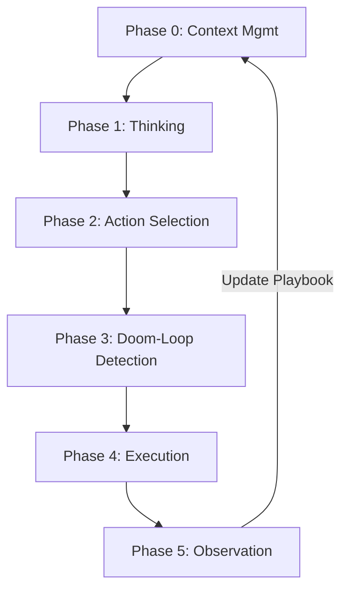
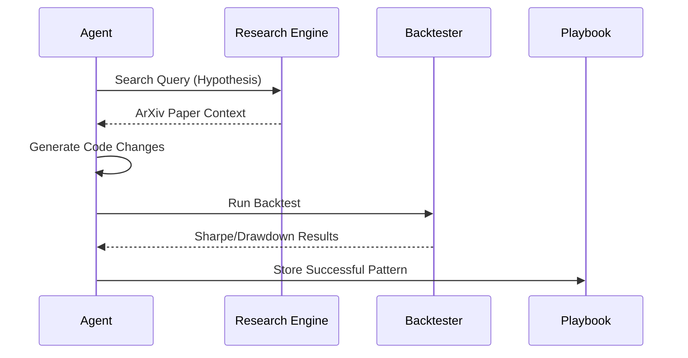

# 🏗️ System Architecture: Quant Autoresearch (OPENDEV)

This document provides a technical deep-dive into the internal architecture of Quant Autoresearch. It is designed to be highly readable for both human engineers and LLMs acting as coding assistants.

---

## 🛰️ System Overview
Quant Autoresearch is a **Compound AI System** designed for autonomous scientific discovery in quantitative finance. It implements the **OPENDEV** (Open-Ended Developer) paradigm, which treats research as a long-horizon code evolution problem.

### Core Philosophy
- **Grounded reasoning**: Hypotheses must be inspired by academic literature (RAG).
- **Immutable Truth**: Backtests are performed in a sandboxed environment with forced signal lags to prevent look-ahead bias and **Monte Carlo validation** to detect luck.
- **Data Agnostic**: Decoupled data ingestion allows the agent to run on any time-series data without code changes.
- **Safety-First Autonomy**: A 5-layer safety model ensures the agent remains within the human-defined "Constitution."

---

## 🔄 The Autonomous Research Loop (6-Phase Cycle)
The system operates on an enhanced ReAct loop, divided into six distinct phases to ensure stability and reasoning depth.

1.  **Phase 0: Adaptive Context Compaction (ACC)**: Monitors token usage and prunes/summarizes historical logs before the next cycle starts.
2.  **Phase 1: Thinking**: Uses a reasoning-optimized model (e.g., Moonshot-v1) to generate a "Reasoning Trace" without tool access. This prevents "action-first" hallucinations.
3.  **Phase 2: Action Selection**: The primary model reviews the reasoning trace and selects appropriate tools from the `LazyToolRegistry`.
4.  **Phase 3: Doom-Loop Detection**: Fingerprints planned actions; if the agent attempts the same failed action 3+ times, the system halts or triggers a re-planning event.
5.  **Phase 4: Execution**: Tools are executed through the **Defense-in-Depth** safety layers.
6.  **Phase 5: Observation & Learning**: Results (Backtest scores, errors) are logged. Successful strategies are stored in the `Playbook` (SQLite) for future reference.

---

## 🧱 Key Components

### 1. `QuantAutoresearchEngine` (`src/core/engine.py`)
The central orchestrator. It manages the state across phases and coordinates between the Model Router and the backtest environment.

### 2. `ModelRouter` (`src/models/router.py`)
Provides abstraction over LLM providers (Groq, Moonshot).
- **Routing Strategy**: Thinker (High intelligence) -> Reasoner (High context) -> Summarizer (Fast/Cheap).
- **Fallback Logic**: If Moonshot fails (401/429), it automatically routes to Groq (Llama-3) to ensure research continuity.

### 3. `SafetyGuard` (`src/safety/guard.py`)
Implements a 5-layer defense:
1. **Prompt Guardrails**: System-level constraints.
2. **Schema Gating**: Restricting tool access based on agent role (Planner vs. Executor).
3. **Runtime Approval**: Human-in-the-loop triggers for high-risk operations.
4. **Tool Validation**: Parameter sanitization.
5. **Lifecycle Hooks**: Code analysis to detect look-ahead bias (e.g., `shift(-1)`).

### 4. `LazyToolRegistry` (`src/tools/registry.py`)
To save context window space, tools are not all loaded at once. The agent searches for tools by keyword, and the registry "lazily" injects the relevant schema into the prompt.

### 5. `Playbook` (`src/memory/playbook.py`)
An episodic memory system using SQLite. It stores successful hypotheses, code, and metrics.
- **Multi-Tenancy**: Supports custom `--db` paths, allowing different research "projects" or users to maintain isolated strategy memories.
- **Success Rate**: A decaying average used to prioritize past "winning" patterns in new prompts.

### 6. `DataConnector` (`src/data/connector.py`)
The abstraction layer for market data.
- **Unified Interface**: Supports `.parquet` and `.csv`.
- **Automated Ingestion**: Built-in methods for `yfinance` and `CCXT` (Binance) ensure the agent always has fresh data.
- **Feature Guard**: Automatically calculates standard features (`returns`, `volatility`, `atr`) during ingestion to ensure backtest consistency.

---

## 📊 Data & Information Flow

---

## 🧬 LLM Guidance (For AI Assistants)
If you are an LLM reading this, follow these structural rules:
1.  **Code Injections**: Only modify the `generate_signals` method in `src/strategies/active_strategy.py`.
2.  **Imports**: Use only `pandas` and `numpy`. Do not attempt to import `os` or `subprocess` within strategy files; the `SafetyGuard` will block it.
3.  **Vectorization**: Always write vectorized Pandas code. Loops will be flagged as high-risk and potentially throttled.
4.  **Regime Awareness**: Prioritize using `volatility` and `atr` features for regime detection before applying momentum signals.
5.  **Statistical Robustness**: Aim for a **P-VALUE < 0.05** during the Monte Carlo phase. Strategies with high P-values are treated as noise and given lower priority in future iterations.

---
*Reference: OPENDEV Terminal Agent Protocol v2.1*
